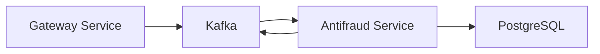

# FC Pay Antifraud

[](https://nestjs.com) [](https://www.typescriptlang.org) [](https://kafka.apache.org) [](https://www.postgresql.org) [](https://opensource.org/licenses/MIT)

A fraud detection service for the FC Pay system, built with NestJS. Implements basic fraud analysis rules and integrates with Kafka for event-driven communication.

## Table of Contents

- [Features](#features)
- [Architecture](#architecture)
- [Getting Started](#getting-started)
- [Docker Setup](#docker-setup)
- [Study Focus](#study-focus)
- [Related Projects](#related-projects)
- [License](#license)

## Features

| Feature | Description |
|---------|-------------|
| 🔍 Transaction Analysis | Basic transaction pattern analysis |
| 🚨 Fraud Detection | Simple fraud detection rules |
| 📨 Kafka Integration | Event-driven communication |
| 🗄️ PostgreSQL | Data persistence with Prisma ORM |
| 🔄 REST API | Basic API endpoints |

## Architecture

### Tech Stack

| Component | Technology |
|-----------|------------|
| Backend | NestJS |
| Database | PostgreSQL 16 |
| Message Queue | Apache Kafka |
| ORM | Prisma |
| Containerization | Docker & Docker Compose |

### System Components



## Getting Started

### Prerequisites

| Requirement | Version | Purpose |
|-------------|---------|---------|
| Node.js | 18+ | Runtime Environment |
| Docker | Latest | Containerization |
| Docker Compose | Latest | Service Orchestration |
| FC Pay Gateway | Running | Kafka & Transaction Processing |

### Installation Steps

1. **Clone the repository**
   ```bash
   git clone https://github.com/brunownk/fc-pay-antifraud.git
   cd fc-pay-antifraud
   ```

2. **Configure environment**
   ```bash
   cp .env.example .env
   # The default environment variables are already configured for Docker
   ```

3. **Verify Gateway Service**

   > ⚠️ **Important**: The Gateway service must be running and healthy before starting the Antifraud service.
   > The Antifraud service depends on Kafka topics created by the Gateway.

   ```bash
   # Check Gateway health
   curl http://localhost:8080/health
   # Expected: {"status":"ok"}

   # Verify Kafka topics exist
   docker exec fc-pay-gateway-kafka-1 kafka-topics --bootstrap-server kafka:29092 --list
   # Should see:
   # - pending_transactions
   # - transaction_results
   ```

4. **Start the service**
   ```bash
   docker-compose up -d
   ```

5. **Verify service health**
   ```bash
   # Check container status
   docker-compose ps
   # Expected: fc-pay-antifraud-app-1 ... (healthy)

   # Check service logs
   docker-compose logs -f app
   # Look for: "Connected to Kafka" and "Listening for transactions"

   # Check API health
   curl http://localhost:3001/health
   # Expected: {"status":"ok"}
   ```

### Service Architecture

The Antifraud service:
1. Consumes transactions from `pending_transactions` Kafka topic
2. Analyzes each transaction for potential fraud
3. Produces results to `transaction_results` topic
4. Provides REST API for manual review and configuration

### Development

For local development:

1. **Install dependencies**
   ```bash
   npm install
   ```

2. **Run database migrations**
   ```bash
   npx prisma migrate dev
   ```

3. **Start in development mode**
   ```bash
   npm run dev
   ```

### Troubleshooting

1. **Kafka Connection Issues**
   ```bash
   # Check Kafka connectivity
   docker-compose logs app | grep Kafka
   
   # Verify topics are accessible
   docker exec fc-pay-gateway-kafka-1 kafka-consumer-groups \
     --bootstrap-server kafka:29092 \
     --list
   ```

2. **Database Issues**
   ```bash
   # Reset database (if needed)
   npx prisma migrate reset
   
   # Check database status
   docker-compose exec db pg_isready
   ```

3. **Common Error Messages**

   - "Error: Connection refused to Kafka"
     - Ensure Gateway service is running
     - Check network connectivity
     - Verify Kafka broker is healthy

   - "Error: Cannot find pending_transactions topic"
     - Verify Gateway service initialized correctly
     - Check Kafka topics list
     - Restart Gateway service if needed

### API Documentation

The service exposes the following endpoints:

- `GET /health` - Service health check
- `GET /metrics` - Service metrics
- `POST /rules` - Create fraud detection rules
- `GET /rules` - List current rules
- `GET /transactions` - List processed transactions

For detailed API documentation, visit `http://localhost:3001/docs` after starting the service.

### Environment Variables

| Variable | Description | Default |
|----------|-------------|---------|
| PORT | Service port | 3001 |
| DATABASE_URL | PostgreSQL connection string | postgresql://... |
| KAFKA_BROKERS | Kafka brokers list | kafka:29092 |
| KAFKA_GROUP_ID | Consumer group ID | antifraud-service |

## Docker Setup

### Network Configuration

The antifraud service connects to the `fc-pay-network` created by the gateway service. The network configuration includes:

- Database: `nestjs-db:5432`
- Kafka: `kafka:29092`
- Antifraud API: `http://localhost:3001`

### Service Dependencies

The antifraud service depends on:
- PostgreSQL 16 (for data persistence)
- Apache Kafka (for event processing)
- The gateway service (for transaction data)

### Health Checks

You can verify the service is healthy by:

1. **Database**
   ```bash
   docker-compose exec nestjs-db pg_isready -U postgres
   ```

2. **Kafka**
   ```bash
   docker-compose exec kafka kafka-topics --bootstrap-server kafka:29092 --list
   ```

3. **Antifraud API**
   ```bash
   curl http://localhost:3001/health
   ```

### Development Mode

To run the service in development mode:

```bash
# Access the container shell
docker compose exec nestjs bash

# Install dependencies
npm install

# Start the development server
npm run start:dev
```

## Study Focus

| Topic | Description |
|-------|-------------|
| 🏗️ NestJS | Framework fundamentals and patterns |
| 📨 Event-Driven | Kafka integration and event processing |
| 🔍 Fraud Detection | Basic fraud analysis patterns |
| 🗄️ Database | Prisma ORM and PostgreSQL operations |

## Related Projects

| Project | Description |
|---------|-------------|
| [Main Repository](https://github.com/brunownk/fc-pay) | Core project repository |
| [Web Interface](https://github.com/brunownk/fc-pay-web) | Web application interface |
| [Gateway Service](https://github.com/brunownk/fc-pay-gateway) | Payment processing API |

## License

This project is licensed under the MIT License - see the [LICENSE](LICENSE) file for details.
