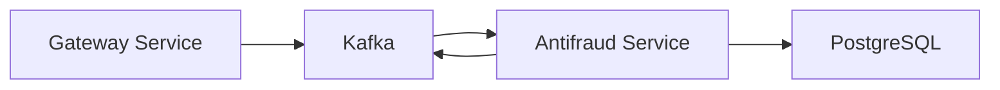

# FC Pay Antifraud

[](https://nestjs.com) [](https://www.typescriptlang.org) [](https://kafka.apache.org) [](https://www.postgresql.org) [](https://opensource.org/licenses/MIT)

A fraud detection service for the FC Pay system, built with NestJS. Implements basic fraud analysis rules and integrates with Kafka for event-driven communication.

## Table of Contents

- [Features](#features)
- [Architecture](#architecture)
- [Getting Started](#getting-started)
- [Docker Setup](#docker-setup)
- [Study Focus](#study-focus)
- [Related Projects](#related-projects)
- [License](#license)

## Features

| Feature | Description |
|---------|-------------|
| 🔍 Transaction Analysis | Basic transaction pattern analysis |
| 🚨 Fraud Detection | Simple fraud detection rules |
| 📨 Kafka Integration | Event-driven communication |
| 🗄️ PostgreSQL | Data persistence with Prisma ORM |
| 🔄 REST API | Basic API endpoints |

## Architecture

### Tech Stack

| Component | Technology |
|-----------|------------|
| Backend | NestJS |
| Database | PostgreSQL 16 |
| Message Queue | Apache Kafka |
| ORM | Prisma |
| Containerization | Docker & Docker Compose |

### System Components



## Getting Started

### Prerequisites

| Requirement | Version |
|-------------|---------|
| Node.js | 18.17+ |
| Docker | Latest |
| Docker Compose | Latest |
| Running Gateway Service | Required |

### Installation Steps

1. **Start the Gateway Service first**
   ```bash
   cd ../fc-pay-gateway
   docker-compose up -d
   ```

2. **Clone the repository**
   ```bash
   git clone https://github.com/brunownk/fc-pay-antifraud.git
   cd fc-pay-antifraud
   ```

3. **Set up environment variables**
   ```bash
   cp .env.example .env
   # The default environment variables are already configured for Docker
   ```

4. **Start the service**
   ```bash
   docker compose up -d
   ```

5. **Verify the service is running**
   ```bash
   docker compose ps
   ```

## Docker Setup

### Network Configuration

The antifraud service connects to the `fc-pay-network` created by the gateway service. The network configuration includes:

- Database: `nestjs-db:5432`
- Kafka: `kafka:29092`
- Antifraud API: `http://localhost:3001`

### Service Dependencies

The antifraud service depends on:
- PostgreSQL 16 (for data persistence)
- Apache Kafka (for event processing)
- The gateway service (for transaction data)

### Health Checks

You can verify the service is healthy by:

1. **Database**
   ```bash
   docker-compose exec nestjs-db pg_isready -U postgres
   ```

2. **Kafka**
   ```bash
   docker-compose exec kafka kafka-topics --bootstrap-server kafka:29092 --list
   ```

3. **Antifraud API**
   ```bash
   curl http://localhost:3001/health
   ```

### Development Mode

To run the service in development mode:

```bash
# Access the container shell
docker compose exec nestjs bash

# Install dependencies
npm install

# Start the development server
npm run start:dev
```

## Study Focus

| Topic | Description |
|-------|-------------|
| 🏗️ NestJS | Framework fundamentals and patterns |
| 📨 Event-Driven | Kafka integration and event processing |
| 🔍 Fraud Detection | Basic fraud analysis patterns |
| 🗄️ Database | Prisma ORM and PostgreSQL operations |

## Related Projects

| Project | Description |
|---------|-------------|
| [Main Repository](https://github.com/brunownk/fc-pay) | Core project repository |
| [Web Interface](https://github.com/brunownk/fc-pay-web) | Web application interface |
| [Gateway Service](https://github.com/brunownk/fc-pay-gateway) | Payment processing API |

## License

This project is licensed under the MIT License - see the [LICENSE](LICENSE) file for details.
